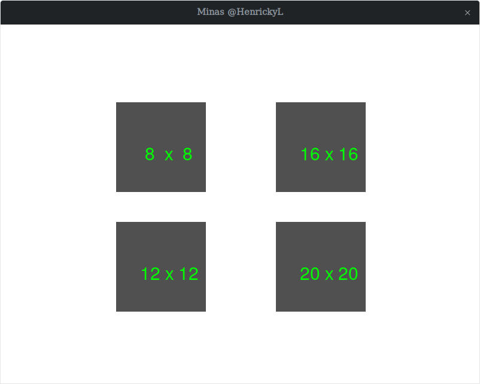
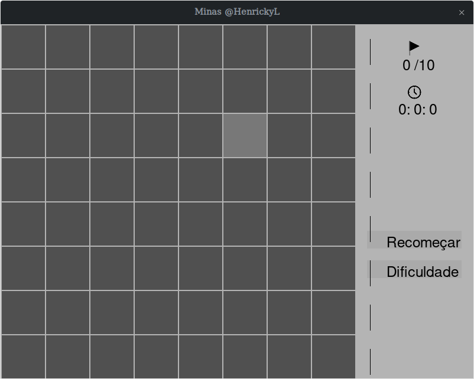
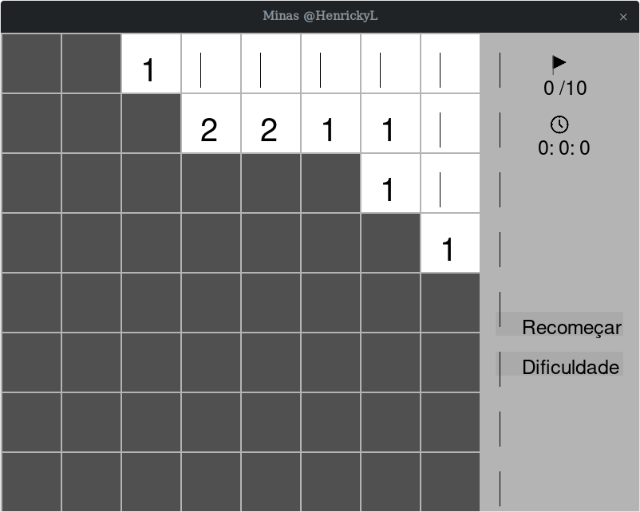
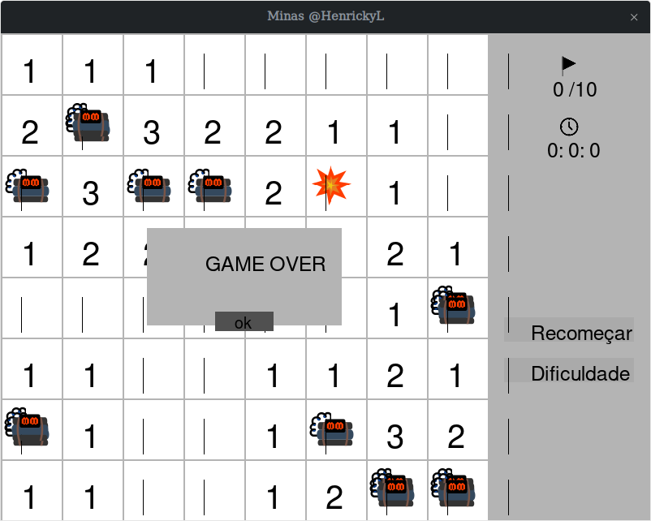

<a href ="https://www.linkedin.com/in/henrickyl/"></a> [](https://www.paypal.com/cgi-bin/webscr?cmd=_donations&business=5EYBZRRUNZ7UA&currency_code=BRL&source=url)






# Minas

##Principais Problemas:

### Matemático:
- gerar uma tabela(matriz) com as bombas em posições aleaórias e os número que representam as bombas a sua volta.

### Gráfico:

- tela inical com botões que geram as células do jogo em dimenão (8x8, 12x12, 16x16, 20x20).
- tela do jogo:
    - Grid em banco onde pode-se clicar e mostrar os números da tabela.
       - obs: a tabela tem que ser criada após o click para que o jogador não comece perdendo.
    - Mostrar o tempo na tela e o botão de reiniciar partida e dificuldade.
    - Fazer o Efeito de abrir uma área quando não há bombas ao redor da célula.
    - 

### Testando função geradora das matrizes

#### Solução:

- usar duas matrizes zeradas de mesma dimensão, em uma mudar os valores de 0 para 1, em posições aleatórias. O valor 1 equivale a ter bomba no local.
- Usando a primeira matriz como referencia, ver posição a posição onde tem bomba e gerar números que são resultado da soma dos valores ao redor da posição, ou deja contar quantas bombas existem ao redor da posição.
- Outra estratégia foi gerar uma matriz maior e trabalhar com a sub-matriz de dentro para não haver problema na verificação ao redor das bordas.

Soma ao redor: 

$$Soma=\sum_{i=-1}^1 \sum_{j=-1}^1 A_{m+i,n+j}$$

representação:

$$\begin{array}{cc}
A_{(m-1)(n-1)} & A_{(m-1)(n-0)}& A_{(m-1)(n+1)}\\
A_{(m-0)(n-1)} & A_{(m)(n)} & A_{(m-0)(n+1)}\\
A_{(m+1)(n-1)}& A_{(m+1)(n+0)} & A_{(m+1)(n+1)}
\end{array}$$

Exemplo de matriz zerada criada, mas vamos trabalhar apenas com os valores de $A_{1,1}$ até $A_{(n-1)(n-1)}$.

$$A=\begin{array}{ccccc}
0&0&0&0&0\\
0&1&0&0&0\\
0&0&0&1&0\\
0&0&0&1&0\\
0&0&0&0&0
\end{array}$$

### Redimensionar imagens:
Na função **Default.Red_img()** redimensiono as imagens usando uma função matemática
```python
A=(82.14895971050655, -3.000135777641224) #parametros da função que redimensiona (B,C) Ax^2 + BX + C para A=0
         n=self.n
        y=A[0]+n*A[1] #y=Bx+C
```
onde uso o método dos mínimos quadrados presente na bibliotea **bib.py**, que consiste em achar a melhor reta ou parábola que passa pelos pontos experimentais, ou seja, para uma função $y=A+Bx+CX^2$, onde passo os valores de xe y e ele me retorna os parâmetros A, B e C.

Logo passando como parâmetros os x (n: numero de linhas da matriz) e y (p: os pixels que achei interessante para para valor de n), obtive os valors **B = 82.14895971050655**, **=A = -3.000135777641224**, na função
$$y=Ax+B$$

### Problemas:
- Comecei usando as matrizes Com A[i][j],para i sendo as linhas, logo y, e j sendo as colunas, logo x. Porém a posição, capturada do mouse, pega em x,y, logo se usar A[x][y] ocorre uma transposição da matriz, por esse motivo alguns códigos na função **Grid.Draw_front** alguns vezes uso A[j][i], para pegar a matriz de forma correta. Como esse problema foi pensado depois alguns trechos foi trocado i,j para "Dar certo".
- Outro problema se dá pelo minha falta de conhecimento no uso de Thread em classes e função, pois no caso de começar um jogo e perder e apertar "OK", ocorre o problema de que o tempo não é mais contado.
- O pior problema de um código deve ser quando acontece algo num caso específico que você não pode tirar e que você não sabe ajeitar. Temos um problema assim, no caso de escolha de um jogo 16X16, onde é adicionada uma nova linha e coluna branca que fica atras dos blocos cinza escuro. Além disso a dimensão das imagens fica errada e é possivel ver as bombar atras entre blocos.
